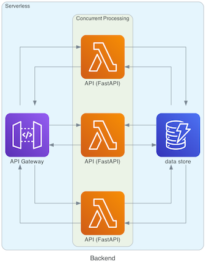

# wasabi-diagrams
Generates diagrams for wasabi documentation.

## Dependencies
Diagrams generator Python library: [diagrams](https://github.com/mingrammer/diagrams)

Graph visualization binary: [Graphviz](https://www.graphviz.org/)

## Installation
### Quick intall
Standard install via `pipenv`
```shell
pipenv --three
pipenv shell
pipenv install
```

### Developer install
Install developer tools (optional)

```shell
pipenv install --dev
pipenv run dev-setup
```

## Settings
Output directory, format, diagrams settings are specified in `src/constants.py` file.

## Run
```shell
cd src
python3 main.py
```
=> output: `./data/[diagram].png`

## Screenshot
